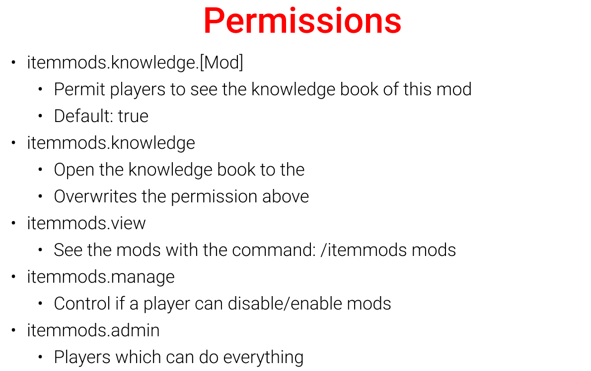

# ItemMods

## Contribute

It will be cool if anybody can help me to maintain this plugin. If you have any question feel free to visit my discord and open a ticket.

## Links

* [Discord](https://discord.gg/WzcRNGF)
* [Wiki](https://github.com/CodeDoctorDE/ItemMods/wiki)
* [Last build](https://ci.codemc.io/job/CodeDoctorDE/job/ItemMods/lastSuccessfulBuild/)
* [API](https://github.com/CodeDoctorDE/ItemMods/wiki/api)

