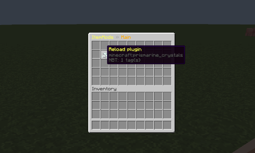
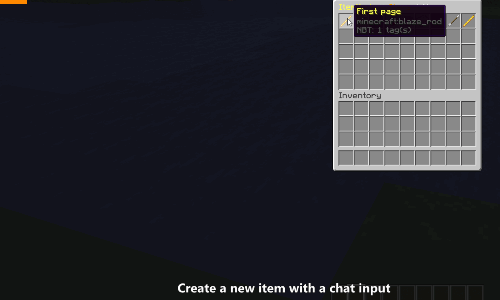
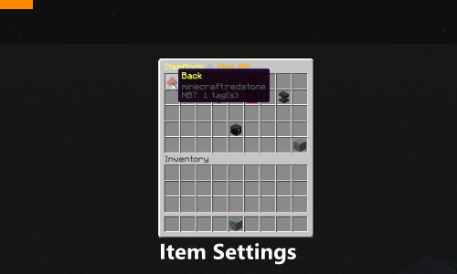

# ItemMods

## Screenshots

### Main GUI

### Item GUI

### Custom Blocks

## Features

* Custom blocks (available 1.1)​
*  Custom items (available 1.0)​
    *  Custom tools (available 1.2)
    *  Custom bone meals (avaiable 1.1)
    *  Custom drops (available 1.2)​
    *  with other tools (coming soon..)​
*  GUI based configuration with JSON (available 1.0)​
*  Keep names, lores, attributes on this item (available 1.0)​
*  A developer who are there for the community (eg. discord)​
*  Developer API​
*  Wiki: https://gitlab.com/codedoctorde/ItemMods/wikis (coming soon...)​
*  Custom command support (available 1.2)​
*  Open source​

## Additional information

* Discord: https://discord.gg/5gmv66J
* Please report bugs here: https://gitlab.com/codedoctorde/itemmods/issues and not in the plugin reviews. Thanks :)
* Wiki: https://gitlab.com/codedoctorde/itemmods/wikis/home
* Website: https://codedoctorde.gitlab.io/itemmods
* API Docs: https://codedoctorde.gitlab.io/itemmods/apidocs/

