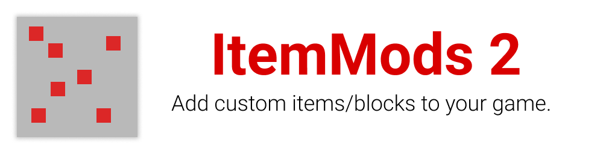

---

*Please note that this plugin is in alpha state and is not ready for production!*

ItemMods is a plugin where you can extend your vanilla experience. 
You can add custom blocks, items and more using a beautiful gui. 
Get started [here](https://itemmods.linwood.dev/docs).
You can add custom textures using the new custom model data added in 1.14.

[Share your pack](https://itemmods.linwood.dev/docs/user/pack#share-the-pack) on our discord or [create an addon](https://itemmods.linwood.dev/docs/api/create-addons) to develop your own modification.

[Read the contribution guide](CONTRIBUTING.md) if you want to help me to develop the plugin.

---

